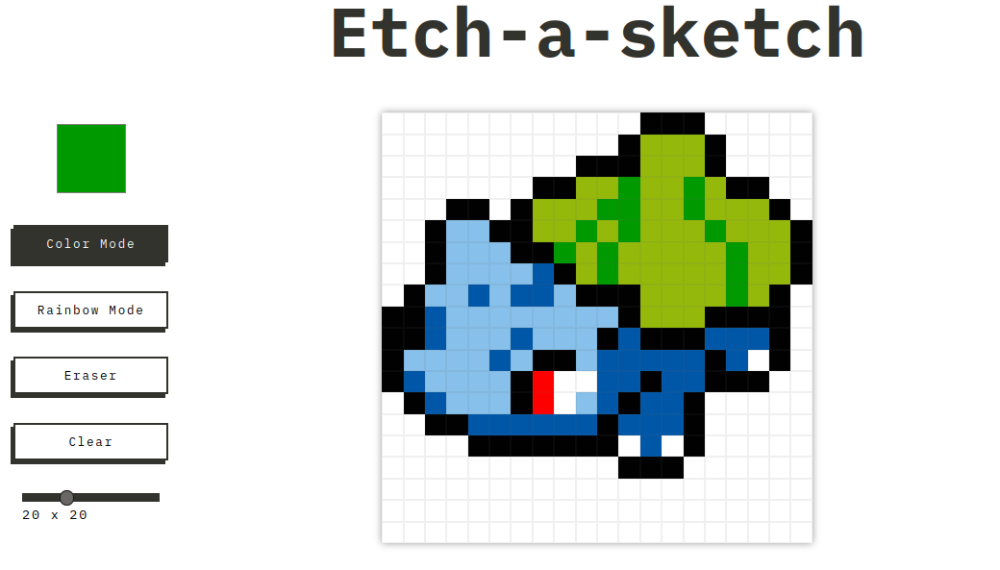

# Etch-a-sketch

This is a pixel-art sketching app.

Features:

- Select a color from the color-picker square in the left.
- Use the Rainbow Mode button to draw rainbows!
- Use the Eraser or the Clear button to erase any pixel.
- Change the size of the grid using the slider at the bottom left.

Future features to implement:

- Save images
- Undo button

[Live Preview](https://osportll.github.io/etch-a-sketch/)

